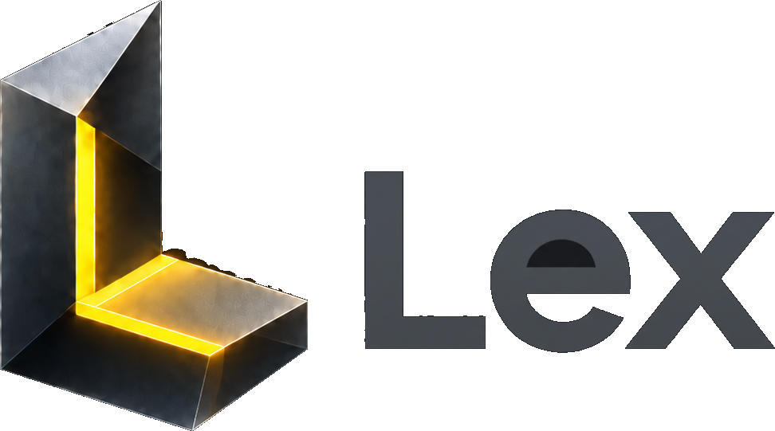

<p align="center">
  <picture>
    <source media="(prefers-color-scheme: dark)" srcset="docs/logo/lex-logo.png" />
    <source media="(prefers-color-scheme: light)" srcset="docs/logo/lex-logo-light.png" />
    
  </picture>
</p>

<p align="center">
  <strong>Your code remembers the AI conversations that talked about it.</strong>
</p>

<p align="center">
  <a href="https://github.com/lukaskellerstein/lex"></a>
  <a href="https://neovim.io/"></a>
  <a href="https://www.lua.org/"></a>
  <a href="https://www.typescriptlang.org/"></a>
  <a href="https://bun.sh/"></a>
  <a href="https://github.com/folke/snacks.nvim"></a>
  <br />
  <a href="https://www.anthropic.com/claude-code"></a>
  <a href="https://github.com/openai/codex"></a>
  <a href="https://opencode.ai/"></a>
  <a href="https://github.com/tmux/tmux"></a>
  <a href="#the-contract"></a>
  <a href="#licence"></a>
</p>

<p align="center">
  <a href="#set-it-up">Set It Up</a> &middot;
  <a href="#use-it">Use It</a> &middot;
  <a href="#what-the-marks-mean">The Marks</a> &middot;
  <a href="#commands">Commands</a> &middot;
  <a href="#configure-it">Configure</a> &middot;
  <a href="#how-it-works">How It Works</a> &middot;
  <a href="#status">Status</a>
</p>

---

Your agent understands your code for one hour. Then the session scrolls away.
The code keeps the change and loses the reason.

Lex keeps the reason. Select some lines, paste them into Claude Code, Codex or
OpenCode, ask your question. Weeks later those lines still carry a mark in
Neovim, and one keypress takes you back into the conversation that talked about
them, running or finished.

```
  12 │ export function login(user: User) {      ▎ 💬 3
  13 │   return retry(() => post("/auth", user))
  14 │ }
```

Three conversations talked about these lines. Press one key and you are in one.

Nothing about your day changes. Your Neovim config stays yours. The agent stays
in its own terminal tab. The conversation stays in the agent's own history. Lex
is only the memory between the two.

---

## Set it up

Three steps, about two minutes.

### 1. Install the plugin

[lazy.nvim](https://github.com/folke/lazy.nvim):

```lua
{
  "lukaskellerstein/lex",
  dependencies = { "folke/snacks.nvim" },
  event = "VeryLazy",
  opts = {},
  keys = {
    { "<leader>ap", "<cmd>LexCopy<cr>", mode = { "n", "x" }, desc = "📌 Copy Lex Place" },
    { "<leader>al", "<cmd>LexLinks<cr>", desc = "💬 Lex conversations here" },
  },
}
```

`opts = {}` is the whole configuration. Every option has a default.

### 2. Wire your agent

Once, from inside Neovim:

```vim
:LexInstallHook            " Claude Code
:LexInstallHook codex      " Codex
:LexInstallHook opencode   " OpenCode
```

Run it for each agent you use. It edits that agent's own config file, writes
absolute paths, and is safe to run twice.

| Agent | Takes effect |
|:--|:--|
| Claude Code | in your next session |
| Codex | start `codex` once and press `t` to trust the hook |
| OpenCode | the next time OpenCode starts |

### 3. Check it

```vim
:checkhealth lex
```

It reads each agent's config, runs the writer once into a throwaway store, and
tells you how long the hook took.

That is the whole setup. There is nothing to run in the background, no daemon, no
account, no index to build.

---

## Use it

1. **Select lines** in a buffer. Or stand on one line. Or pick a file or a folder
   row in the explorer.
2. **Press `<leader>ap`.** The lines turn blue with a `📌 1` badge: copied, not
   sent yet.
3. **Paste into your agent** and type your question around it. Paste a second
   place if the question needs two.
4. **Send.** The blue turns yellow. That is the proof the link was written.
5. **Later**, on any of those lines, press `<leader>al` and then `<CR>`.

`<CR>` finds the agent wherever it is, any tmux session, any terminal, any
desktop, and takes you there. If the session has stopped, you pick where to
start it again and Lex resumes it for you.

What you copy is a tagged block, so the agent reads real code:

```xml
<lex-place n="1" path="/abs/aaa/src/auth.ts" repo="/abs/aaa" file="src/auth.ts" lines="12-15" lang="typescript">
export function login(user: User) {
  return retry(() => post("/auth", user))
}
</lex-place>
```

You never type that. You never edit it. Paste it and ask your question.

---

## What the marks mean

| Phase | Colour | Sign | Badge |
|:--|:--|:--|:--|
| selecting | blue, nvim's own Visual | | |
| **pending**: copied, not sent | faint blue wash | dashed `┆` | `📌 1`, your own number |
| **history**: the link is written | yellow wash | solid `▎` | `💬 3` |
| the session is answering right now | green | | `working…` |

Put the cursor inside a marked range and the badge grows to show the newest
prompt and its age. Nothing moves, no line is inserted. Where ranges overlap the
wash goes one tone deeper and the sign column shows two bars.

Files change all day, so a link can be in one of four states:

| State | What happened | What you get |
|:--|:--|:--|
| `ok` | the code is where it was | the mark |
| `moved` | the code is elsewhere in the file, or edited | the mark, on the code |
| `orphaned` | the code is gone | no mark, still in the list, greyed, with the code the conversation saw |
| `gone` | the agent deleted its transcript | listed, nothing to open |

A link never points at code the conversation did not see. Lex finds your lines
again by their text, never by their old line number.

---

## Commands

| Command | What |
|:--|:--|
| `:LexCopy` | copy this place for an agent |
| `:LexLinks` | the conversations on the row under the cursor |
| `:LexLinks file` | the conversations in this file |
| `:LexLinks repo` | everything the agents talked about in this project |
| `:LexWash` | the line wash on or off, for quiet reading |
| `:LexClear` | forget the copied, unsent places |
| `:LexInstallHook [claude\|codex\|opencode]` | wire the writer into an agent |
| `:checkhealth lex` | is it all installed, and how fast is the hook |

---

## The list

One row is one conversation: the session, the agent, the age, what it holds
here, and where its agent is open right now. The preview is the conversation as
it happened, turn by turn, with the places each prompt carried and the agent's
last answer.

| Key | What |
|:--|:--|
| `<CR>`, double click | go to the agent |
| `g` | go to the lines |
| `d` | forget this conversation, after a confirm |
| `q` | close |

`d` removes Lex's memory of a conversation. It never touches the agent's own
history.

---

Everything below is optional.

---

## Configure it

```lua
require("lex").setup({
  wash = true,        -- the line background under a linked range
  icon = "💬",
  pin = "📌",
  colors = {
    lex = "#EACB4A",                             -- the product colour
    tone = { "#2F2C1B", "#3D381F", "#4B4423" },  -- the wash, deeper on overlap
    running = "#66AD93",
    pending = "#8FB4F0",
  },
  agents = {
    claude = { name = "Claude Code", resume = { "claude", "--resume" } },
    codex = { name = "Codex", resume = { "codex", "resume" } },
    opencode = { name = "OpenCode", resume = { "opencode", "-s" } },
  },
  opener = nil,    -- fun(t): your machine's own way to a session's window
  where = nil,     -- fun(loc, snap): what only your machine knows, for the list
  terminal = nil,  -- nil tries Ghostty, WezTerm, kitty, Alacritty, $TERMINAL,
                   -- Terminal.app; a name picks one; a function does it your
                   -- way; false hides the "new terminal" entry
})
```

A fourth agent is one more entry in `agents`, plus a writer that speaks the
contract.

`$LEX_HOME` moves the store away from `~/.lex`.

---

## A count in the statusline

A lualine component, `💬 9/12`: the conversations still anchored in this file,
and the ones in the whole project. Left click opens the file, right click opens
the project.

```lua
{
  function() return require("lex.statusline").component() end,
  on_click = function(_, button) require("lex.statusline").click(button) end,
}
```

## A count in the file tree

The snacks explorer, in its `format` hook, asks Lex about each visible row: the
count, `?N` for lost ones, the pin for a pending row, and the wash.

```lua
local lex = require("lex.explorer")
local info = lex.info(path, is_dir)   -- per row
-- lex.chunks(info)  → extmark chunks, right-aligned next to the git letter
-- lex.wash(info)    → a line_hl_group name, or nil
```

A whole file or a whole folder is a place too: pick the row in the explorer and
copy it. A folder place is one block however many files are under it, and it
marks every one of them.

---

## A right-click item instead of a key

`:LexCopy` and `require("lex").copy()` are the same call. It reads the current
selection, the cursor line, or the explorer rows under the mouse, so one menu
item covers every surface:

```lua
for _, mode in ipairs({ "n", "x" }) do
  vim.cmd(mode .. "noremenu PopUp.📌\\ Copy\\ Lex\\ Place <Cmd>LexCopy<CR>")
end
```

Two details, both learned the hard way. Use `nnoremenu` and `xnoremenu`, never
one `anoremenu`: the `a` form wraps the Visual variant in `<C-C>`, which ends
Visual before the command runs, and then there is no selection left to copy. And
use `<Cmd>`, which keeps the mode alive.

If you would rather build the block yourself:

```lua
local place, pending = require("lex.place"), require("lex.pending")
local p = place.for_buffer(buf, from, to)   -- or place.for_path(path)
p.n = pending.add(p)
vim.fn.setreg("+", place.block(p))
vim.notify("Lex: copied " .. place.describe(p))
```

---

## How it works

Two halves live in this repository.

| Half | What it does | Where |
|:--|:--|:--|
| **The writer** | a hook inside the agent. It runs on every prompt, finds the `<lex-place>` blocks in it, and appends one record per place | `agents/` |
| **The reader** | `lex.nvim`. It paints the marks, counts the conversations, and takes you back into one | the repo root |

The writer is small and strict. It never fails your prompt, never prints to
stdout, runs no git and no network, and finishes in under 10 milliseconds. It is
a single Lua file run by `nvim -l` for Claude Code and Codex, and a TypeScript
plugin for OpenCode.

### The store

```
~/.lex/<repo-slug>/links.jsonl     one line per place per prompt, append-only
~/.lex/sessions/<session>.json     what each session is doing right now
~/.lex/hook.log                    a writer that failed, one line
```

`<repo-slug>` is the **main** repository root with every character that is not a
letter or a digit turned into `-`, so a git worktree and the main checkout share
one store. The store lives outside every repository, so nothing of yours is
committed by accident.

A record is a photo of the moment: the time, the agent, the session id, the
process, the tmux pane, the transcript path, the file, the lines, the code
itself, two lines of context each side, and the first line of your question.
About 1 to 2 KB. It is never rewritten. Forgetting is the one exception, and it
takes a lock.

It is a plain file because three writers in three languages and one reader share
it, and a file is the one interface all four have for free.

### Going back into a conversation

`<CR>` finds the session by three exact proofs, in order: its own state file, a
live process whose command line carries the session id, and the process holding
its transcript open. It then jumps to that tmux pane or that window. Nothing is
guessed, and a stored pane is never trusted on its own, because the next session
in that pane would take you to the wrong conversation.

If nothing is running, you pick a new terminal or any tmux session, and Lex runs
`claude --resume <id>`, `codex resume <id>` or `opencode -s <id>` there.

### The contract

`contract/` is what keeps three parsers in three languages equal: one prompt with
every block form, the records it must produce, and the rules in words. Change the
block in `lua/lex/place.lua`, in `agents/claude-code/hook.lua`, in
`agents/opencode/index.ts` and in `contract/`, or in none of them.

```sh
sh tests/run.sh
```

Every test runs headless under `nvim -l`. The OpenCode writer's test runs under
Bun when Bun is on your PATH.

---

## Requirements

| Need | Why |
|:--|:--|
| Neovim 0.10 or later, 0.12 tested | the plugin, and the hook runs as `nvim -l` |
| [snacks.nvim](https://github.com/folke/snacks.nvim) | the list, and the explorer counts |
| git | the repository root is the key of the store |
| tmux, optional | jumping to a running session, and resuming in a new window |
| Bun, optional | only to run the OpenCode writer's test |

## Status

Early. The writers, the store, the marks, the list and the resume are built and
tested, and Claude Code has run end to end. Codex and OpenCode are tested against
the contract, but their wiring has not been exercised live yet.

`PLAN.md` holds the whole design: every decision with its date, what was
measured, what was rejected, and what is still open.

## Licence

MIT.
